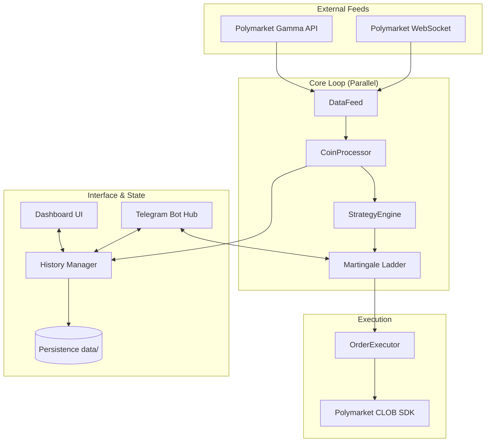

# Architecture

> Generated by Antigravity on 2026-03-28

## Overview

A high-performance, low-latency Polymarket trading bot that implements a **Martingale Streak-Reversal** strategy across multiple crypto price markets (BTC, ETH, SOL, XRP). The system uses parallel processing to eliminate sequential execution lag and features an interactive Telegram-based control hub.

## System Diagram

## Components

### CoinProcessor (`src/main.py`)
- **Purpose**: Manages the lifecycle of a single coin's trading loop.
- **Location**: `src/main.py:CoinProc`
- **Logic**: Handles 15-min boundary detection, candle resolution, and signal triggering.
- **Parallelism**: Multiple instances run in a `ThreadPoolExecutor`.

### StrategyEngine (`src/strategy.py`)
- **Purpose**: Implements the streak-reversal logic (3+ candles in same direction).
- **Martingale**: Manages the doubling ladder ($3, $6, $13, $28, $60).

### DataFeed (`src/data_feed.py`)
- **Purpose**: Unified interface for live market data (Orderbook asks/bids).
- **Feed**: Uses shared `DataFeed` class for zero sequential delay across coins.

### Telegram Bot Hub (`src/telegram_bot.py`)
- **Purpose**: Interactive 3x3 menu for system control.
- **Features**: Live prices, balance checks, manual trading flow, and emergency stop/resume.

### History Manager (`src/history_manager.py`)
- **Purpose**: Persistence layer for candles, positions, and trade logs.
- **Files**: `data/candles.json`, `data/martingale_state.json`.

## Data Flow

1. **Market Update**: `DataFeed` receives live asks/bids via WebSocket.
2. **Boundary Hit**: `CoinProc` detects 15-min candle close.
3. **Signal Check**: `StrategyEngine` analyzes last 3 closes.
4. **Order Execution**: `OrderExecutor` places FOK (market) or GTC (limit) orders via the CLOB SDK.
5. **Notification**: `TelegramNotifier` sends updates on signals, placements, and results.

## Technical Debt

- [ ] PnL calculation needs refinement to account for entry price vs. settlement.
- [ ] Manual trade flow needs completion (Direction selection).
- [ ] Centralized `OrderExecutor` file exists but `main.py` has its own `_place` logic (Inconsistency).
- [ ] Multi-threaded logging can occasionally interleave.
